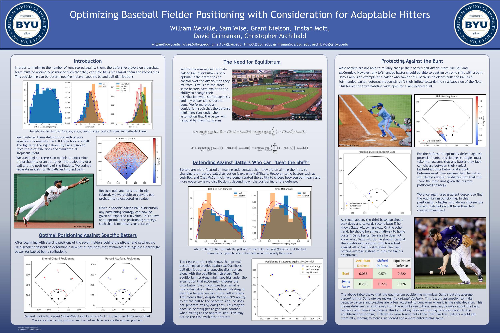

### 2026 Big Data Bowl - Finalist
My project, along with Evan Miller, Connor Thompson, and Evan West, uses physics and a neural network to determine the optimal locations for interceptions and incompletions for NFL defenseive backs. Check out our [video and writeup](https://www.kaggle.com/competitions/nfl-big-data-bowl-2026-analytics/writeups/the-decision-point).

### 2025 Big Data Bowl
We used CNNs to predict run v. pass, and which quadrants receivers would end in. We then identified the [most predictable teams and schemes](https://www.kaggle.com/code/jacobmarkmiller/anticipating-play-outcomes/notebook).

### Semien Hit Streak
This is a [Bayesian simulation](https://github.com/grantnielson/Sports-Projects/blob/main/Semien_Hit_Streak_Nielson_Final.pdf) to calculate the probability of Marcus Semien achieving a 20+ game hit streak in the 2025 season.

### Pitch_Deception
My project attempts to quantify "Deception" among MLB pitchers. 
The ipynb file serves as an appendix, the docx explains everything.

### Sloan Slide
This is a fielder optimization project I helped work on that won 3rd place at Sloan in 2024.

### Blog
Basketball_viz_blog_link is a link to a blog where I analyzed 2021 March Madness results to sharpen my python visualization skills.

### These are two data visualization projects I carried out to expand my skills in R, and provide interesting graphics to answer my questions and appeal to other BYU fans on Twitter.

For 'BYU STATES RECORDS', I was interested in visualizations with a US map, so I decided to depict BYU's all-time football record in each state they played during the 2022-'23 season.

QBR is a plot comparing QBRs (per ESPN, I know there are many different QBR metrics out there), using data from cfbfastR. 
I felt that Jaren Hall (BYU's QB) performed better (QBR) than the team did (W/L record); looking at the results, it seems like he did. 
He also outperformed all other QBs he faced, except one.

